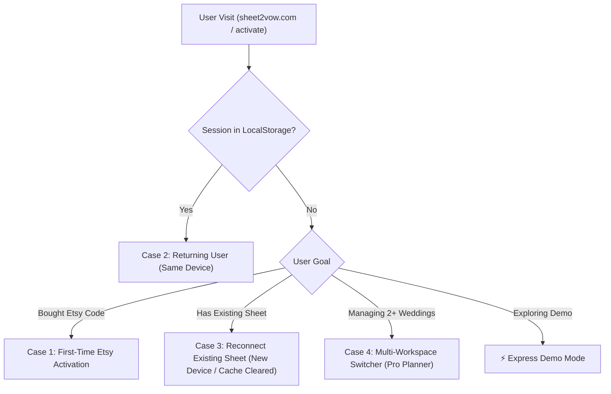

# Sheet2Vow & Sheet2Suite User Lifecycle & User Flows

> **Authoritative Specification Document**  
> **Topic:** User Lifecycle Architecture, Device Re-entry, Reconnection Mechanisms, Multi-Workspace Switching, and Sheet2Suite Shared Activation Portal

---

## 1. User Lifecycle Overview

Sheet2Vow operates as a **local-first, privacy-focused application**: user data resides strictly within a single Google Sheet copied into the user's personal Google Drive, while active session tokens and local state parameters reside in client-side `localStorage`.

This document defines the authoritative specification for how Sheet2Vow and the broader Sheet2Suite handle the 4 primary user lifecycle use cases across devices and sessions.

---

## 2. Detailed Lifecycle Specifications

### 2.1 Use Case 1: First-Time Net New User (Etsy Purchase)

- **Trigger:** Customer purchases Sheet2Vow on Etsy or Etsy digital download link.
- **Entry Point:** `https://sheet2vow.com/activate?orderId=ETSY-XXXXX&email=user@domain.com`
- **Flow:**
  1. System extracts `orderId` and `email` parameters from URL or user input form.
  2. `/api/verify-order` validates the purchase against the Etsy license registry.
  3. User selects setup preferences (⚡ Quick 1-Min Setup vs. 🧙 Guided 4-Step Journey).
  4. System copies Master Wedding Sheet template directly into `My Drive/Wedding Planning/` in the user's personal Google Drive via Google Workspace API.
  5. Local session tokens (`s2v_spreadsheet_id`, `s2v_is_onboarded = 'true'`) are written to `localStorage`.
  6. Dashboard initializes and loads workspace.
- **Post-Activation User Guidance:**
  - Informational dialog displays:
    - 📁 **Google Drive Path:** `My Drive/Wedding Planning/`
    - 🔗 **Direct URL / Bookmark:** `sheet2vow.com/#home`
    - 🔑 **Spreadsheet ID & Re-entry Key**

---

### 2.2 Use Case 2: Returning User on SAME Device

- **Trigger:** User opens `sheet2vow.com` on a browser where they previously completed activation.
- **Flow:**
  1. Application mounts (`page.tsx`), reads `s2v_spreadsheet_id` and `s2v_is_onboarded` from `localStorage`.
  2. If `s2v_is_onboarded === 'true'`, application bypasses onboarding and opens the active wedding dashboard with **0 clicks**.
- **User Guidance:** Zero interaction required; seamless auto-load.

---

### 2.3 Use Case 3: Returning User on DIFFERENT Device (or Cleared Browser Cache)

- **Trigger:** User opens `sheet2vow.com` on their mobile phone, tablet, or a new browser where `localStorage` is empty.
- **Flow:**
  1. Application detects empty `localStorage` (`isOnboarded === false`) and renders the Onboarding Hub.
  2. Onboarding Hub provides a prominent **`"🔑 RECONNECT EXISTING WEDDING SPREADSHEET"`** option alongside Express Demo and New Setup.
  3. User chooses one of **3 Reconnection Methods**:
     - **Option A (Google Drive Scanner - 1-Click Google Sign-In):** User authenticates with Google. App queries Google Drive API for existing files named `*Sheet2Vow Master Wedding Planner*` and presents a 1-tap selector.
     - **Option B (Etsy Order Lookup):** User inputs Etsy Email + Order ID. Server retrieves the associated `spreadsheetId` and restores session state.
     - **Option C (Spreadsheet ID / URL Paste):** User pastes their Google Sheet URL (`https://docs.google.com/spreadsheets/d/1A2B3C.../edit`).
  4. Selected `spreadsheetId` is stored in `localStorage`, and dashboard auto-loads.

---

### 2.4 Use Case 4: Pro Planner / Multi-Wedding Coordinator (Managing Multiple Weddings)

- **Trigger:** Professional wedding coordinator or couple managing multiple wedding events (e.g., *Sarah & Mark 2026*, *Jessica & Dave 2027*).
- **Flow:**
  1. Header & Quick Settings feature a **`📁 WORKSPACE SWITCHER`** dropdown.
  2. `localStorage` maintains an array of known workspaces: `s2v_workspaces = [{ id: 'sheetId1', name: 'Sarah & Mark', date: '2026-09-20' }, ...]`.
  3. Selecting a workspace from the dropdown updates `s2v_spreadsheet_id`, re-fetches dashboard metrics, and updates URL hash `#home` instantaneously.
  4. "➕ Add / Connect Another Wedding Workspace" option opens the Reconnection / Setup wizard to register additional sheets.

---

## 3. Sheet2Suite Unified Shared Activation Strategy

To support future Sheet2 products (Sheet2Stay, Sheet2Finances, Sheet2Events) without duplicating registration logic, the activation architecture will be centralized under **Sheet2Suite Shared Activation**:

- **Universal Activation Portal:** `https://activate.sheet2suite.com` (or `/activate` in shared engine).
- **Multi-SKU Order Lookup (`/api/verify-order`):** Validates Etsy / Lemon Squeezy order IDs and returns entitled products:
  - Etsy Order for Sheet2Vow → Entitles *Sheet2Vow Wedding Planner*.
  - Etsy Order for Sheet2Suite Bundle → Entitles *Sheet2Vow*, *Sheet2Finances*, *Sheet2Events*.
- **Product Selector Hub:** Displays entitled apps with 1-click launch buttons.

---

## 4. Backlog Task Definitions (`[LIFE-1]` through `[LIFE-5]`)

| Task ID | Feature Requirement | Target File | Status |
|---|---|---|---|
| **`[LIFE-1]`** | **"Reconnect Existing Sheet" Onboarding Tab:** Add Reconnect tab on landing page allowing users on a new device to reconnect via Google Drive Auto-Detect, Etsy Order ID, or Sheet URL. | `page.tsx` | Pending |
| **`[LIFE-2]`** | **Google Drive Auto-Detect Sheet Selector:** 1-Click Google Drive scanner that lists existing Sheet2Vow files in the user's Drive for 1-tap reconnection. | `googleSheets.ts` | Pending |
| **`[LIFE-3]`** | **Multi-Workspace Switcher Dropdown:** Header/Settings dropdown storing `s2v_workspaces[]` list so pro planners can switch client weddings in 1 click. | `page.tsx` | Pending |
| **`[LIFE-4]`** | **Post-Activation Guidance Banner:** Clear informational modal after activation detailing how to find their Google Drive sheet and bookmark their URL. | `OnboardingWizard.tsx` | Pending |
| **`[LIFE-5]`** | **Sheet2Suite Shared Activation Engine (`activate.sheet2suite.com`):** Modularize order verification API to support multi-product SKU entitlements across the Sheet2 Suite. | `/api/verify-order` | Pending |
