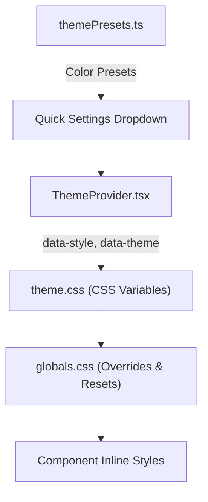

# Sheet2Vow UX/UI Design Audit Report

> **Date:** 2026-08-07  
> **Scope:** Full UX/UI review across all 4 design styles × 2 color modes (8 total theme combinations)  
> **Goal:** Simplify, clean up, and make the interface usable for everyday wedding planners — not power users.  
> **Suite Context:** Sheet2Vow is part of the Sheet2 Suite (Sheet2Vow, future Sheet2X apps). UI patterns established here will set the standard.

---

## 1. Executive Summary

Sheet2Vow has a **strong foundation** — a well-structured CSS variable token system, 4 distinct design styles with light/dark variants, and a consistent component architecture across 16 manager components. However, the rapid feature growth has introduced **UX debt** in several areas:

- **Contrast violations** in dark mode modal headers
- **CSS override fragility** — 100+ lines of `!important` band-aids in `globals.css`
- **Font inheritance gaps** for Botanical & Tuxedo styles
- **Inconsistent modal patterns** across components
- **Settings dropdown usability** issues on smaller screens
- **Hardcoded color values** leaking through inline styles

The findings below are organized by severity and impact, with each proposed change tracked as a backlog task.

---

## 2. Design Style System Analysis

### 2.1 Current Architecture

| Style | Light Canvas | Dark Canvas | Typography | Border Radius | Shadows |
|---|---|---|---|---|---|
| **Editorial** | `#ffffff` | `#121212` | Playfair Display + Inter | 4/8/12px | Soft gaussian |
| **Neo-Brutalism** | `#F4F4F0` | `#0B0F19` | Inter + Geist Mono | 2/4/6px | Hard offset `3px 3px` |
| **Botanical Romance** | `#f9f6f0` | `#2a2e2a` | Cormorant Garamond + Nunito | 8/16/24px | Sage-tinted |
| **Midnight Tuxedo** | `#f8f9fa` | `#09090b` | Bodoni Moda + Montserrat | 0/0/0px | Minimal line shadows |

### 2.2 Font Loading Issue

> [!WARNING]
> **Botanical and Tuxedo fonts may not be loading properly.** The CSS variable chain depends on `--font-cormorant-google`, `--font-nunito-google`, `--font-bodoni-google`, and `--font-montserrat-google` being set by the Google Fonts loader in [layout.tsx](file:///d:/Development/sheet2vow/src/app/layout.tsx). If these CSS custom property names don't match what `next/font/google` generates, the fallback chain silently degrades to system fonts, making Botanical and Tuxedo look identical to Editorial.

**Proposed Task:** `[UX-1]` — Verify and fix font variable chain for Botanical & Tuxedo

---

## 3. Contrast & Accessibility Audit

### 3.1 Modal Headers in Dark Mode

> [!CAUTION]
> **Critical contrast failure.** All CRUD modals (GuestListManager, VendorManager, MusicManager, etc.) use `backgroundColor: var(--color-primary)` with `color: var(--color-on-primary)` for modal headers.

In **Editorial Dark** mode, `--color-primary` is `#2d3748` (dark slate) and `--color-on-primary` is `#ffffff`. This works.

But in **Midnight Tuxedo Dark** mode, `--color-primary` is `#ffffff` (pure white) and `--color-on-primary` is `#000000`. The modal header becomes a **bright white bar** that visually clashes with the near-black `#09090b` page background. Meanwhile, `globals.css` line 275-283 forces ALL dark-mode modal headers to `color: #000000 !important`, which happens to be correct for Tuxedo Dark but **breaks** Editorial Dark headers (where the header is dark slate and text should be white).

| Theme Combo | Header BG | Text Color | CSS Override | Result |
|---|---|---|---|---|
| Editorial Light | `#0d1b2a` (navy) | `#ffffff` | None | ✅ Good |
| Editorial Dark | `#2d3748` (slate) | `#ffffff` → overridden to `#000000` | `globals.css:282` | ❌ **Black text on dark slate** |
| Neo-Brutalism Light | `#121824` (charcoal) | `#00ED64` | None | ✅ Good |
| Neo-Brutalism Dark | `#11552D` (forest) | `#ffffff` → overridden to `#000000` | `globals.css:282` | ❌ **Black text on dark green** |
| Botanical Light | `#5c715e` (sage) | `#ffffff` | None | ✅ Good |
| Botanical Dark | `#849b87` (soft sage) | `#1a1e1a` → overridden to `#000000` | `globals.css:282` | ⚠️ Acceptable |
| Tuxedo Light | `#111111` (black) | `#ffffff` | None | ✅ Good |
| Tuxedo Dark | `#ffffff` (white) | `#000000` | `globals.css:282` | ✅ Works by accident |

**Proposed Task:** `[UX-2]` — Fix modal header contrast across all 8 theme combos. Remove the blanket `!important` override and use proper `var(--color-on-primary)` token inheritance.

### 3.2 Settings Dropdown Button Text in Dark Mode

The quick-settings dropdown (`settingsDropdown` class) forces `background-color: #000000` and `color: #ffffff` in dark mode via `globals.css:321-339`. The **Design Style toggle buttons** inside use inline styles with `color: var(--color-text)` for unselected state. But `--color-text` in dark mode varies per style:
- Editorial Dark: `#e0e0e0` ✅
- Neo-Brutalism Dark: `#F4F4F0` ✅  
- But the settings dropdown overrides force `color: #ffffff !important` on all children, including the **selected** button that has `backgroundColor: var(--color-primary)`.

In **Tuxedo Dark**, the selected button background is `#ffffff` (white) and the text color is forced to `#ffffff` → **white text on white button**. Invisible.

**Proposed Task:** `[UX-3]` — Fix settings dropdown button contrast in Tuxedo Dark & Botanical Dark.

### 3.3 Error Box Hardcoded Colors

The `errorBox` style in [page.tsx:1523-1534](file:///d:/Development/sheet2vow/src/app/page.tsx#L1523-L1534) uses hardcoded `backgroundColor: '#fee2e2'` and `color: '#ef4444'`. In dark mode, this light pink box looks jarring against dark backgrounds.

**Proposed Task:** `[UX-4]` — Use `var(--color-red-muted)` and `var(--color-red)` tokens for error boxes.

### 3.4 Auth Status Box Hardcoded Background

The onboarding `authStatusBox` in [page.tsx:1313-1319](file:///d:/Development/sheet2vow/src/app/page.tsx#L1313-L1319) uses `backgroundColor: '#eef2f7'` — a hardcoded light blue that doesn't respond to dark mode or design style changes.

**Proposed Task:** `[UX-5]` — Replace with `var(--color-bg-subtle)` token.

### 3.5 Sync Banner Hardcoded Background

The `syncBanner` style at [page.tsx:1420](file:///d:/Development/sheet2vow/src/app/page.tsx#L1420) uses `backgroundColor: '#f8f9fa'`, ignoring dark mode entirely.

**Proposed Task:** `[UX-6]` — Replace with `var(--color-bg-subtle)` or `var(--color-surface)` token.

---

## 4. CSS Architecture Concerns

### 4.1 `!important` Overload in `globals.css`

> [!WARNING]
> [globals.css](file:///d:/Development/sheet2vow/src/app/globals.css) currently contains **80+ `!important` declarations** acting as style-attribute-selector band-aids. This pattern is fragile, hard to debug, and creates a specificity war between CSS and inline React styles.

Key problem areas:
- Lines 115-145: Neo-Brutalism contrast rules matching inline `style` attribute strings
- Lines 256-273: Save/Submit button color enforcement
- Lines 275-283: Dark mode modal header override (causes contrast bugs)
- Lines 387-415: Universal button text enforcement via `style*=` attribute selectors

These `style*=` attribute selectors (e.g., `button[style*="background-color: #121824"]`) are an **anti-pattern** because:
1. They break when React formats the inline style differently
2. They're invisible to developers reading component code
3. They only match exact hex strings, missing CSS variable references

**Proposed Task:** `[UX-7]` — Migrate `!important` overrides to semantic CSS classes. For example, instead of matching `button[style*="background-color: #121824"]`, add a `className="btn-dark"` to those buttons and target the class.

### 4.2 Duplicate Token Definitions

The `--style-name` token is defined in `[data-style='botanical-romance'][data-theme='light']` but not in the dark variant. Similarly for Tuxedo. This is cosmetic but indicates inconsistent token coverage.

### 4.3 Missing UI Tokens for Botanical & Tuxedo

Botanical and Tuxedo styles don't define `--border-radius-*` or `--border-width` in their dark mode blocks, so they inherit from `:root` (Editorial defaults). This is actually intentional for Tuxedo (which uses the same `0px` in light and dark), but Botanical dark inherits `4/8/12px` border-radius from `:root` instead of the `8/16/24px` it uses in light mode.

**Proposed Task:** `[UX-8]` — Add `--border-radius-*` and `--transition-smooth` to Botanical Dark and Tuxedo Dark blocks for completeness.

---

## 5. Modal Pattern Consistency

### 5.1 Modal Header Patterns Across Components

I audited all 16 component files. The modal header pattern is **mostly consistent** but has notable variations:

| Pattern | Components | Header Style |
|---|---|---|
| **Standard** (primary bg, on-primary text) | GuestList, Vendor, Music, Budget, Kanban, Photos, ThankYou, Timeline, Seating | `backgroundColor: var(--color-primary)` |
| **Neutral** (bg surface, text) | AdvancedSettings, Menu | `backgroundColor: var(--color-bg)` |
| **Branded** (primary icon, no bg fill) | ShareModal | No header fill, icon only |
| **Delete Confirm** (red bg, white text) | All CRUD components | `backgroundColor: var(--color-red)` |

The **Standard** and **Neutral** patterns are fine. The issue is that the neutral-header modals (AdvancedSettings, ShareModal) look visually different from the standard ones — no colored header bar. For Sheet2 Suite consistency, one pattern should be chosen.

**Proposed Task:** `[UX-9]` — Standardize modal header pattern across all modals. Recommend: all modals use the primary-bg header for visual consistency, or all use the neutral bg header for a cleaner look.

### 5.2 Modal Close Button Inconsistency

Some modals have `className="modalHeader"` (enabling `globals.css` dark-mode overrides) and some don't. [MenuSetupManager](file:///d:/Development/sheet2vow/src/components/MenuSetupManager.tsx#L312) and [VendorShareLinkManager](file:///d:/Development/sheet2vow/src/components/VendorShareLinkManager.tsx#L514) are missing the `className`.

**Proposed Task:** `[UX-10]` — Add `className="modalHeader"` to all modal headers for consistent dark-mode styling.

---

## 6. Quick Settings Dropdown UX

### 6.1 Current Layout

The settings dropdown at [page.tsx:508-648](file:///d:/Development/sheet2vow/src/app/page.tsx#L508-L648) packs **Design Style (4 buttons)**, **Color Mode (2 buttons)**, **Primary Color (preset dots + custom picker + reset)**, and **Dev Mode toggle** into a 240px-wide floating panel.

Issues:
- **4 design style buttons in a 2×2 grid** with `flex: '1 1 45%'` creates awkward wrapping on small screens
- **Color preset dots are 20px** — small touch targets on mobile
- **No visual preview** of what each design style looks like before selecting
- **"RESET" button** is unclear — reset to what? The default for the current style, or the original editorial navy?

### 6.2 Improvement Suggestions

**Proposed Task:** `[UX-11]` — Increase color preset swatch dots to 28px for better touch targets.

**Proposed Task:** `[UX-12]` — Add a subtle description label under each design style button (e.g., "Serif + Soft Shadows" for Editorial, "Geist Mono + Hard Shadows" for Brutalism).

**Proposed Task:** `[UX-13]` — Clarify the "RESET" label. Change to "RESET TO DEFAULT" and add a tooltip explaining it resets to the theme's default primary color.

---

## 7. Navigation Tab Bar UX

### 7.1 Tab Labels

Current tab labels use bracket notation: `[ SUMMARY ]`, `[ GUEST LIST ]`, `[ FINANCIALS ]`, etc.

This is a **strong brand identity choice** for the editorial/monospace aesthetic, but:
- The brackets add visual noise for everyday users
- The labels are ALL-CAPS monospace, which reduces readability
- On mobile, the wrapping tab bar creates uneven rows

### 7.2 Tab Count

With all modules enabled, there are **11 tabs**: Summary, Guest List, Catering, Seating Chart, Ledger, Timeline, Vendors, Task List, Music, Photos, Thanks. This is a lot of horizontal navigation items.

**Proposed Task:** `[UX-14]` — Consider grouping related tabs. For example, "Catering" and "Seating Chart" could be sub-views of a "Reception" parent tab, reducing the top-level count. This is a larger architecture decision for the Sheet2 Suite.

---

## 8. Toast Notifications

The [ToastNotification](file:///d:/Development/sheet2vow/src/components/ToastNotification.tsx) component is clean and well-themed. One minor issue:

- The toast uses `backgroundColor: 'var(--color-surface)'` — in Neo-Brutalism Dark mode, `--color-surface` is `#121824` and the border is `2px solid var(--color-green)`. This can look very subtle and easy to miss on the dark background.

**Proposed Task:** `[UX-15]` — Consider a slightly elevated surface color (`var(--color-bg-hover)`) for toasts in dark mode to ensure they stand out from the page.

---

## 9. Sheet2 Suite Consistency Considerations

For the Sheet2 Suite (future apps beyond Sheet2Vow), the following patterns should be locked in as **Suite-Wide Standards**:

| Design Decision | Current State | Recommendation |
|---|---|---|
| **Design Styles** | 4 styles baked into `theme.css` | ✅ Keep all 4. They serve different customer personas. |
| **CSS Variable Naming** | `--color-primary`, `--font-serif`, etc. | ✅ Well-named. Adopt as Suite standard. |
| **Modal Pattern** | Mixed colored/neutral headers | 🔧 Standardize to one pattern |
| **Button Contrast** | 80+ `!important` overrides | 🔧 Migrate to semantic classes |
| **Font Loading** | `next/font/google` with CSS variable bridging | 🔧 Verify the variable name chain works |
| **Toast Pattern** | Themed, non-intrusive | ✅ Good as-is |
| **Tab Navigation** | Horizontal wrapped tabs | 🔧 May need sidebar for apps with many sections |

---

## 10. Proposed UX Backlog Tasks

| Task ID | Title | Category | Severity | Effort | Notes |
|---|---|---|---|---|---|
| `[UX-1]` | Verify & fix Botanical/Tuxedo font variable chain | Fonts | 🔴 High | 🟢 Low | Fonts silently degrade to system defaults |
| `[UX-2]` | Fix modal header contrast across all 8 theme combos | Contrast | 🔴 High | 🟡 Medium | Remove blanket `!important`, use proper tokens |
| `[UX-3]` | Fix settings dropdown button contrast in Tuxedo/Botanical Dark | Contrast | 🔴 High | 🟢 Low | White-on-white text in Tuxedo Dark |
| `[UX-4]` | Use color tokens for error boxes | Tokens | 🟡 Medium | 🟢 Low | Hardcoded `#fee2e2` in dark mode |
| `[UX-5]` | Use `var(--color-bg-subtle)` for auth status box | Tokens | 🟡 Medium | 🟢 Low | Hardcoded `#eef2f7` ignores dark mode |
| `[UX-6]` | Use token for sync banner background | Tokens | 🟡 Medium | 🟢 Low | Hardcoded `#f8f9fa` ignores dark mode |
| `[UX-7]` | Migrate `!important` overrides to semantic CSS classes | Architecture | 🟡 Medium | 🔴 High | 80+ `!important` rules; large refactor |
| `[UX-8]` | Add missing border-radius tokens to Botanical/Tuxedo Dark | Tokens | 🟢 Low | 🟢 Low | Botanical Dark inherits wrong border-radius |
| `[UX-9]` | Standardize modal header pattern across all components | Consistency | 🟡 Medium | 🟡 Medium | Choose colored-header or neutral-header |
| `[UX-10]` | Add `className="modalHeader"` to all modal headers | Consistency | 🟡 Medium | 🟢 Low | MenuSetup & VendorShareLink missing class |
| `[UX-11]` | Increase color preset swatch size to 28px | Touch UX | 🟢 Low | 🟢 Low | 20px dots are small touch targets |
| `[UX-12]` | Add design style subtitle descriptions | Discoverability | 🟢 Low | 🟢 Low | Users don't know what each style looks like |
| `[UX-13]` | Clarify "RESET" button label and behavior | Clarity | 🟢 Low | 🟢 Low | Ambiguous label |
| `[UX-14]` | Consider tab grouping to reduce navigation count | Architecture | 🟢 Low | 🔴 High | 11 tabs is a lot; Suite-level decision |
| `[UX-15]` | Elevated toast background in dark mode | Visibility | 🟢 Low | 🟢 Low | Toasts can blend into dark background |

### Priority Recommendation

**Immediate (fix before next deploy):**
- `[UX-1]` Font chain — users literally cannot tell Botanical from Tuxedo right now
- `[UX-2]` Modal header contrast — broken in 3 of 8 theme combos
- `[UX-3]` Settings dropdown — broken in Tuxedo Dark

**Short-term (next sprint):**
- `[UX-4]`, `[UX-5]`, `[UX-6]` — Quick token swaps for dark mode correctness
- `[UX-8]`, `[UX-10]` — Missing token/class additions
- `[UX-11]`, `[UX-13]` — Quick usability wins

**Medium-term (Suite standardization):**
- `[UX-7]` — The `!important` refactor is the biggest win for maintainability
- `[UX-9]` — Modal pattern decision (design review needed)
- `[UX-12]` — Design style descriptions

**Long-term (architecture):**
- `[UX-14]` — Tab grouping / sidebar navigation (aligns with existing `[NAV-1]` backlog item)

---

## 11. What's Already Working Well

> [!TIP]
> These are genuine strengths worth preserving as Suite-wide patterns.

- ✅ **CSS Variable Token System** — Well-structured with semantic naming across canvas, text, accent, status, and interactive categories
- ✅ **`data-style` + `data-theme` attribute pattern** — Clean selector architecture that avoids className collisions
- ✅ **Color preset system** in `themePresets.ts` — Curated palettes per style/mode with auto-switch on theme change
- ✅ **Toast notifications** — Non-intrusive, themed, auto-dismiss
- ✅ **Disconnect confirmation modal** — Good destructive-action UX with red header, explicit confirmation
- ✅ **Module enable/disable** — Users can hide tabs they don't need, reducing complexity
- ✅ **Responsive tab wrapping** — Works on mobile (though could be improved with sidebar)
- ✅ **Print media styles** — Dedicated `@media print` rules for clean PDF output

